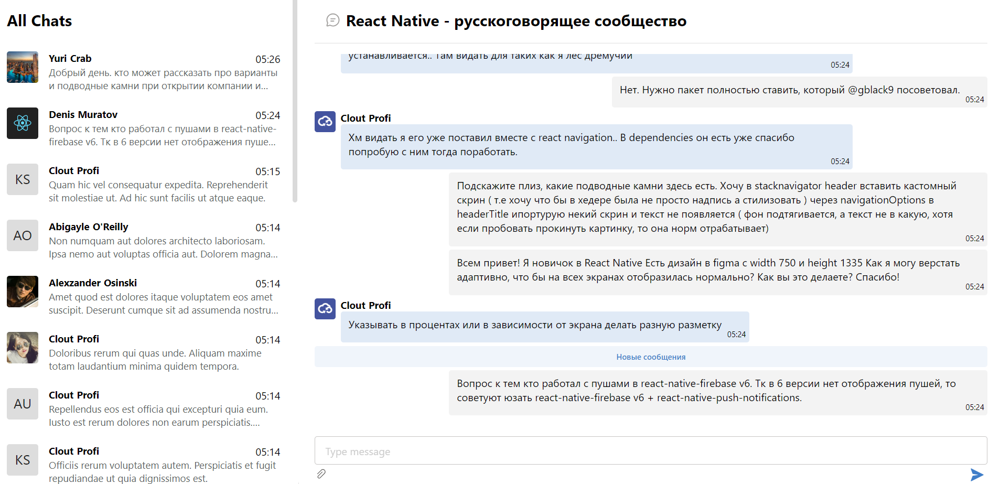

# Приложения Chats

## [ссылка](https://akirpichenok.github.io/chats/)

- В левой части список чатов
- В правой части открывается чат с сообщениями

## Стек
- Typescript
- React
- Redux
- Axios
- Dayjs
- Sass

### Структура проекта

api - методы для работы с бекэндом
components - хранение компонентов
constants - любые константы используемые в проекте
interface - общие интерфейсы
pages - список страниц проекта
utils - общие функции

##### TODO
- Подключить WebSocket
- Добавить авторизацию
- Отделить ui компоненты от бизнесовых
- Перейти на React 18
- Добавить Unit, e2e тесты

